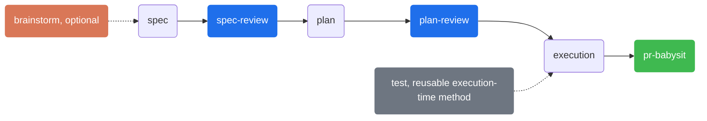
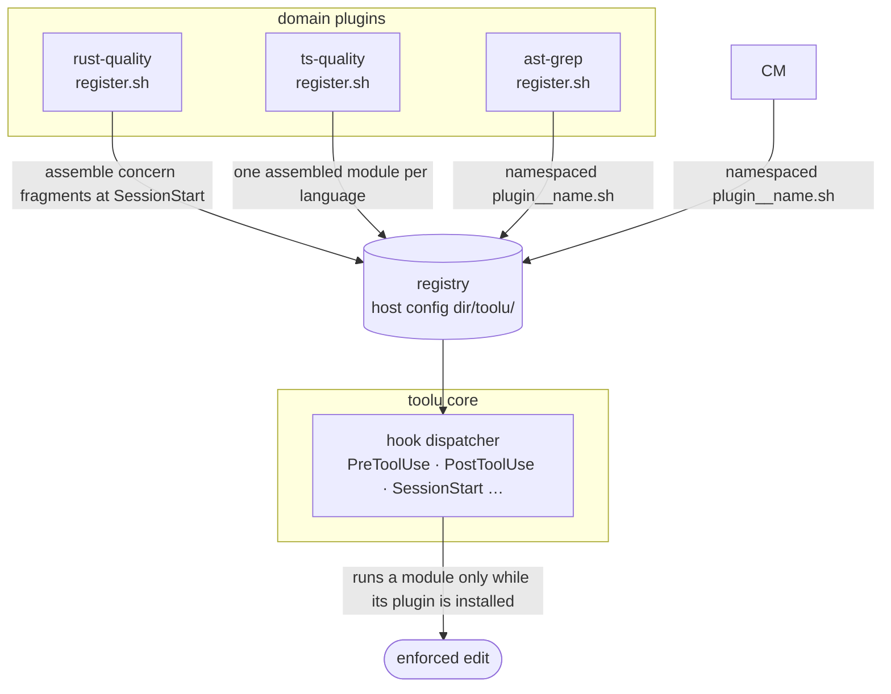

<div align="center">

# toolu

### Engineering discipline, wired into your AI coding agent.

AI writes code fast — then skips the parts that keep a codebase alive: oversized files, swallowed errors, mock-only tests, undocumented exports, unreviewed pushes. **toolu** bakes that discipline back in — as hooks that gate every edit, skills that enforce an adaptive design-to-delivery workflow, and a plugin registry so language-specific rules ride along automatically. Runs on **Claude Code and Codex**.

[](https://github.com/Falconiere/toolu/releases)
[](./LICENSE)
[](#testing)
[](#install)
[](#contributing)

[Why](#why) · [The quality gate](#the-quality-gate) · [Install](#install) · [What's inside](#whats-inside) · [Workflow skills](#workflow-skills) · [Architecture](#architecture) · [Configuration](#configuration)

</div>

---

## Why

Your AI coding agent is a superb pair-programmer, but left alone it optimizes for *getting the change in*, not for the conventions that make a change safe to keep. You end up re-typing the same review feedback every session: *split that file, don't swallow that error, that test is all mocks, document the export, don't push that unreviewed.*

toolu moves those rules out of your head and into the tool:

- **Hooks enforce on every edit** — a post-edit quality gate checks each file the agent touches and **blocks the session from moving on while any error, warning, or test failure exists** — even in unrelated files.
- **Skills enforce a process** — a six-stage delivery chain with write/review checkpoints before execution, so design happens before code and review happens before delivery.
- **A registry keeps it modular** — drop in a domain plugin (Rust rules, TypeScript rules, structural search) and its hook modules register themselves into the core engine, fail-closed, with zero wiring.

It's a personal bundle, built in the open, MIT-licensed. Take the whole thing or lift the pieces you like.

## The quality gate

The headline feature. When `rust-quality`, `ts-quality`, and/or `python-quality` is installed, every Rust/TypeScript/Python file the agent edits is checked on the spot. Limits are **config-driven** (project/user override → the active native linter's `max-lines` → built-in default), and the gate is **multi-slot**: a failing test command and a failing file check are tracked independently, so fixing one never silently masks the other.

<table>
<tr><th align="left">TypeScript</th><th align="left">Rust</th><th align="left">Python</th></tr>
<tr valign="top"><td>

- File / function line limits
- No `../` relative imports — use the `@/` alias
- No `as` type assertions — use a type guard
- No hand-rolled type guards — use a Zod schema
- Tests colocated in a flat `__tests__/`
- Duplicate-type detection across the tree
- "Does too much" / too-many-factories heuristics

</td><td>

- File / function / `impl` line limits
- No `.unwrap()` / `.expect()` — use `?` or `match`
- No `unsafe` blocks
- No `#[allow]` / `#[expect]` lint suppression
- Tests in `tests/`, never inline `#[cfg(test)]`
- Flat `tests/` layout enforced

</td><td>

- File / function line limits
- No bare `except:` / one-line `except: pass`
- No blanket `# noqa` / `# type: ignore`
- No mocks in `test_*.py` / `*_test.py`
- Tests colocated as `test_*.py` next to the module
- Docstrings on public `def`/`class` (advisory)

</td></tr>
</table>

The rule isn't "warn and move on" — it's a hard gate: **no new task while the gate is red.** Found a real problem? Fix it in code. (There's no "disable this check" escape hatch by design.)

## Install

toolu has first-class packages for Claude Code and Codex. Codex support covers
the CLI, IDE extension, and ChatGPT desktop Codex on macOS and Linux.

### OpenCode (preview)

OpenCode support is **git-clone + Bun** only (no npm package yet). It wires
`permission.evaluate` to the same bash gate engine for the coverage proven in
[#212](https://github.com/Falconiere/toolu/issues/212) — not the full Claude/Codex
hook surface. Prerequisites, frozen install, project `.opencode/` layout, gate
smoke, update, and uninstall: **[docs/opencode.md](docs/opencode.md)**. Claude
Code and Codex installs below are unchanged.

### Install everything

Paste one prompt into the host. It adds the marketplace and installs every
plugin in the catalog, core first. Do not install comemory.

#### Claude Code

<!-- install-everything:claude -->
```text
Install every toolu plugin for Claude Code at user scope. Run these commands in a terminal, in order. Skip a command that reports the marketplace or plugin is already installed.

claude plugin marketplace add anthropics/claude-plugins-official
claude plugin marketplace add Falconiere/toolu
claude plugin install toolu@toolu --scope user
claude plugin install agent-browser@toolu --scope user
claude plugin install ast-grep@toolu --scope user
claude plugin install context7@toolu --scope user
claude plugin install exa-search@toolu --scope user
claude plugin install jev@toolu --scope user
claude plugin install jira@toolu --scope user
claude plugin install pr-babysit@toolu --scope user
claude plugin install python-quality@toolu --scope user
claude plugin install rust-quality@toolu --scope user
claude plugin install statusline@toolu --scope user
claude plugin install toolu-review@toolu --scope user
claude plugin install ts-quality@toolu --scope user
```
<!-- /install-everything:claude -->

#### Codex

<!-- install-everything:codex -->
```text
Install every toolu plugin for Codex. Run these commands in a terminal, in order. Skip a command that reports the marketplace or plugin is already installed. After they are installed, review and trust the hooks in /hooks before they run.

codex plugin marketplace add Falconiere/toolu
codex plugin add toolu@toolu
codex plugin add agent-browser@toolu
codex plugin add ast-grep@toolu
codex plugin add context7@toolu
codex plugin add exa-search@toolu
codex plugin add jev@toolu
codex plugin add jira@toolu
codex plugin add pr-babysit@toolu
codex plugin add python-quality@toolu
codex plugin add rust-quality@toolu
codex plugin add statusline@toolu
codex plugin add toolu-review@toolu
codex plugin add ts-quality@toolu
```
<!-- /install-everything:codex -->

> **Note** — `pr-babysit`, `python-quality`, `rust-quality`, and `ts-quality` depend on `toolu`. The other catalog plugins are standalone. `code-simplifier` is an **optional, recommended companion**, not required — install it only if you want the pre-simplify pass; when absent, `toolu` simply skips it. The Claude prompt adds `anthropics/claude-plugins-official` first so Claude Code can resolve that companion. The prompt does not install `code-simplifier`. The `push-review` gate is **reviewer-agnostic**: the built-in `/code-review` skill satisfies it, as does the `toolu-review:review` skill.

> **Deprecation:** comemory host integration now lives in
> [Falconiere/comemory](https://github.com/Falconiere/comemory). First obtain a
> current comemory binary and verify `comemory install --help`; then run
> `comemory install claude` or `comemory install codex`. After that succeeds,
> disable the legacy plugin with `/plugin uninstall comemory@toolu` or
> `codex plugin remove comemory@toolu`.

To migrate an existing legacy installation, obtain the standalone `comemory` binary:

```bash
brew install Falconiere/tap/comemory   # macOS + Linuxbrew (canonical)
# or the curl installer:
curl --proto '=https' --tlsv1.2 -LsSf https://github.com/Falconiere/comemory/releases/latest/download/comemory-installer.sh | sh
```

Plugins that depend on the core detect a missing installation at SessionStart
and print the exact repair command: `codex plugin add toolu@toolu`.

Codex discovers the same canonical workflows as namespaced skills:

- `$toolu:commit`, `$toolu:review-and-commit`
- `$statusline:status`
- `$pr-babysit:babysit`
- `$toolu:setup` to preview, install, update, back up, or remove the five bundled Codex agent profiles

Codex requires explicit hash-based trust before plugin hooks execute. Review and
trust the installed hooks through Codex's `/hooks` interface after installation;
a changed hook must be trusted again. Codex cloud and Windows are not supported
in this release. Custom agent profiles are installed locally under
`${CODEX_HOME:-~/.codex}/agents`, so they are also unavailable in Codex cloud.

## What's inside

Thirteen plugins, one marketplace. Every plugin ships synchronized Claude and
Codex manifests at the repository version (`4.10.0` here). Install the core
alone, or add the domain plugins.

| Group | Plugin | Version | What it does |
|--------|--------|:-------:|--------------|
| Core | **`toolu`** | `4.10.0` | Registry-driven hook engine, adaptive delivery workflow, commit workflows, model routing, push-review gate, and custom-agent templates. |
| Quality gate | **`rust-quality`** | `4.10.0` | Rust post-edit checks — size limits, `.unwrap()`/`.expect()` bans, no `unsafe`, no lint suppression, flat real-data tests. |
| Quality gate | **`ts-quality`** | `4.10.0` | TypeScript post-edit checks — size limits, imports, type assertions/guards, duplicate types, and colocated real-data tests. |
| Quality gate | **`python-quality`** | `4.10.0` | Python post-edit checks — size limits, no suppression (bare `except:`/`# noqa`/`# type: ignore`), docstrings, colocated real-data tests. |
| Code intel | **`ast-grep`** | `4.10.0` | Structural code search and rewrite plus a registry-driven text-to-AST nudge. |
| Browser | **`agent-browser`** | `4.10.0` | Token-lean browser automation through accessibility-tree snapshots and stable element references. |
| Knowledge | **`context7`** | `4.10.0` | Live library documentation and code examples through Context7. |
| Knowledge | **`exa-search`** | `4.10.0` | Web, code, URL search, and deep research through Exa. |
| Knowledge | **`jev`** | `5.3.0` | Typed judgments from TypeSafe's Jev model — probabilities, choices, and scores a script can branch on. |
| Workflow | **`jira`** | `4.10.0` | Jira Cloud and Server/DC search plus safe issue workflow operations. |
| Workflow | **`toolu-review`** | `4.10.0` | Pre-push review matching the CI review bot and writing review attestations. |
| Workflow | **`pr-babysit`** | `4.10.0` | Strict PR clearance through Claude cron or a durable Codex goal with isolated worktrees. |
| Status | **`statusline`** | `4.10.0` | Persistent Claude statusline plus an explicit Codex repository/gate status report. |

Beyond the plugins, the core (`toolu`) also ships:

- **\`push-review\` gate** — blocks \`git push\` on a feature branch until the diff has been run through an accepted reviewer (the built-in \`/code-review xhigh --fix\` skill or the \`toolu-review:review\` skill), with a round cap (5 rewrites against an unchanged diff) that escalates instead of looping forever. The state file lives under the pushed repo's own root, so `git -C <worktree> push` is gated on the worktree's branch and diff.
- **docs-sync backstop** — on `git push`, an **advisory** (never a block) when the branch diff changes code but no documentation surface (README, `docs/` guides, `SKILL.md` triggers) — a nudge to keep user-facing docs in sync with behavior. Silenced by a diff-`sha`-keyed attestation; surfaces are tunable via `docsSync.*` ([config](docs/config.md#docs-sync-surfaces-docssync)). Pairs with the "Docs in sync" convention the workflow skills enforce.
- **Commit workflows** — Claude exposes `/commit` and `/review-and-commit`; Codex exposes `$toolu:commit` and `$toolu:review-and-commit`. Both read the same canonical workflow files, preventing host drift.
- **Model routing** — delegated work is tiered by its *class*, not its phrasing. Claude defaults to Haiku/Sonnet/Opus aliases; Codex defaults to Luna/medium for mechanical work, Terra/medium for exploration and implementation, Terra/high for review, and Sol/high for synthesis and architecture. Both mappings are configurable in [config](docs/config.md#model-routing-models).
- **Tier-pinned agents** — Claude reads the bundled agent definitions directly. `$toolu:setup` manages Codex TOML profiles for `quick-task` (Luna/medium, read-only), `deep-explore` and `research-agent` (Terra/medium, read-only), `implementer` (Terra/medium, workspace-write), and `architect` (Sol/high, read-only), with previews, conflict refusal, timestamped backups, and recoverable removal.

## Workflow skills

A native, opinionated delivery chain. `brainstorm` is optional upstream triage; the delivery path has a **write step and a review step** before execution, which owns local readiness and the verified PR handoff:



- **`brainstorm`** (Brainstorm) is optional upstream triage: it uses adaptive materiality triage and a default-and-proceed baseline, skipping mechanical work and reserving full analysis for material design risk.
- **`spec`** writes a design contract to `docs/toolu/specs/`; **`spec-review`** audits it.
- **`plan`** turns the spec into concrete steps; **`plan-review`** checks it's executable.
- **`execution`** drives the plan with real-data verification, complete acceptance-criteria and documentation checks, local review readiness, and—when delivery is authorized—the automatic `pr-babysit` handoff.
- **`test`** is a reusable execution-time method for real-data tests (no mocks), colocated by language; it is not a terminal phase.

Mechanical work (renames, dep bumps, one-liners) skips the ceremony — each skill declares when *not* to fire.

The workflow skills, plus `ast-grep`, `context7`, and `exa-search`, all run off the same shell hook engine. The standalone `deep-research` skill combines `exa-search` and `context7` fan-out into cited reports under `docs/research/`.

## Architecture

Everything a plugin ships lives under its own `plugins/<name>/` directory — no symlinks, no content outside the plugin root — so a marketplace install gets the whole working tree. Domain plugins contribute hook modules to the core dispatcher through a **runtime registry**:



At `SessionStart`, each domain plugin's `register.sh` contributes to the registry as `<plugin-spec>__<name>.sh` — `ast-grep` mirrors its `hooks/<event>.d/*.sh` one-to-one, while `rust-quality`/`ts-quality`/`python-quality` assemble their ordered `hooks/concerns/` fragments into a single module per language. The core executes those copies **only while the owning plugin is installed** — uninstall the plugin and its rules vanish, fail-closed.

<details>
<summary><b>Full repository layout</b></summary>

```text
.
├── docs/                       # Runtime config schema, design notes
└── plugins/
    ├── toolu/                  # Core plugin: hook engine + process gates
    │   ├── .claude-plugin/     # Claude Code plugin.json manifest
    │   ├── .codex-plugin/      # Codex plugin.json manifest
    │   ├── skills/             # brainstorm (optional), spec(+review), plan(+review),
    │   │                       #   execution, test (reusable), deep-research
    │   ├── agents/             # quick-task, deep-explore, research-agent, implementer, architect
    │   ├── commands/           # commit, review-and-commit
    │   ├── hooks/              # PreToolUse / PostToolUse / SessionStart … + lib/
    │   └── settings/           # reusable settings fragments
    ├── ast-grep/               # ast-grep skill + Grep→ast-grep nudge registry module
    ├── context7/               # context7 skill + Context7 REST wrapper
    ├── exa-search/             # exa-search skill + Exa REST wrapper
    ├── jev/                    # jev skill + TypeSafe System One REST wrapper
    ├── rust-quality/           # Rust PostToolUse quality fragments, assembled at SessionStart
    ├── ts-quality/             # TypeScript PostToolUse quality fragments, assembled at SessionStart
    ├── python-quality/         # Python PostToolUse quality fragments, assembled at SessionStart
    ├── statusline/             # optional gate-aware statusline + SessionStart symlink hook
    ├── pr-babysit/             # Claude command + Codex skill + strict shared workflow
    └── toolu-review/            # toolu-review:review skill + push-review state writer
```

</details>

## Configuration

Toggle individual skills, hooks, or MCP servers without uninstalling anything.
Claude uses `~/.claude/toolu.config.json` and `<repo>/.claude/toolu.config.json`;
Codex uses `${CODEX_HOME:-~/.codex}/toolu.config.json` and
`<repo>/.codex/toolu.config.json`. `TOOLU_CONFIG_DIR` and
`TOOLU_PROJECT_CONFIG_DIRNAME` override both roots. Defaults are opt-out — no
file required.

```json
{
  "version": 1,
  "skills": { "comemory": false }
}
```

Quality-gate thresholds (file/function/impl line limits) are configurable per project and per language. Full schema and examples: [`docs/config.md`](./docs/config.md).

## Testing

The hook engine and language gates are covered by **1700+ [bats](https://github.com/bats-core/bats-core) tests**, all run in CI on every push, including real temporary-home Codex install/remove smoke coverage:

```sh
bun run test              # runs lint:shell → test:shell
bats -r plugins tooling   # shell-only, fast feedback
bun run lint:shell        # shellcheck: standalone scripts + assembled concern modules
```

## Contributing

PRs and issues welcome.

1. Pick the right home — skill vs. agent vs. command vs. hook — and use the existing siblings as templates.
2. Add tests (`*.bats`, colocated in a `__tests__/`) for any hook logic.
3. Verify in a real session before committing.
4. Use a [Conventional Commits](https://www.conventionalcommits.org/) subject (`feat(skills): add foo`).

## Releases

Releases are automated with [release-please](https://github.com/googleapis/release-please) — you do **not** bump versions or tag by hand. The repo ships as **one version**: `toolu` and every plugin share the same `vX.Y.Z`.

- Merge Conventional Commits to `main`. release-please maintains one batched **Release PR** for the whole repo. **Any** path counts — a `feat` in `tooling/` or `.github/` releases just like one under `plugins/`.
- `feat` / `fix` / `feat!` (or `BREAKING CHANGE`) drive minor / patch / major bumps; `chore` / `docs` / `ci` / `refactor` ship no release.
- Review the Release PR, then **merge it to cut the release** — the only manual step. It bumps root `package.json`, `@toolu/core` / `@toolu/opencode` / `@toolu/conformance`, and every Claude and Codex plugin manifest to the new version, updates `CHANGELOG.md`, tags `vX.Y.Z`, and publishes the GitHub Release. The marketplace re-extracts a plugin when its manifest version changes.

`tooling/release.sh` is **deprecated**, kept only as a manual escape hatch for when the automation is unavailable.

## References

- [Claude Code docs](https://docs.claude.com/en/docs/claude-code) ·
  [Skills](https://docs.claude.com/en/docs/claude-code/skills) ·
  [Subagents](https://docs.claude.com/en/docs/claude-code/sub-agents) ·
  [Slash commands](https://docs.claude.com/en/docs/claude-code/slash-commands) ·
  [Hooks](https://docs.claude.com/en/docs/claude-code/hooks) ·
  [Plugins](https://docs.claude.com/en/docs/claude-code/plugins)
- [Codex plugins](https://developers.openai.com/plugins/build/plugins) ·
  [Hooks and trust](https://learn.chatgpt.com/docs/hooks) ·
  [Custom subagents](https://learn.chatgpt.com/docs/agent-configuration/subagents)

## License

[MIT](./LICENSE) © [Falconiere Barbosa](https://github.com/falconiere)
