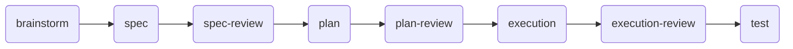

# toolu — Core Plugin

**Type:** Core | **Version:** 1.18.0 | **Depends on:** `code-simplifier`, `caveman`

The registry-driven hook engine plus the 8-phase workflow, the `push-review` gate, and the `deep-explore` agent. **The one required plugin** — all domain plugins register into it.

## Install

```text
# Add prerequisite marketplaces first
/plugin marketplace add anthropics/claude-plugins-official
/plugin marketplace add JuliusBrussee/caveman
/plugin marketplace add Falconiere/toolu

/plugin install toolu@toolu
```

## What It Provides

### 1. 8-Phase Workflow

An opinionated process chain where each phase has a **write step and a review step**:



| Phase | Skill | What It Does |
|-------|-------|-------------|
| **brainstorm** | `brainstorm` | Surface intent, constraints, prior art, and trade-offs. Decide the shape before any code. |
| **spec** | `spec` | Write a design contract to `docs/toolu/specs/<date>-<slug>-design.md`. |
| **spec-review** | `spec-review` | Adversarial audit of the spec — gaps, ambiguities, untestable acceptance criteria. |
| **plan** | `plan` | Turn the reviewed spec into concrete, verifiable steps with a machine-readable ledger. |
| **plan-review** | `plan-review` | Pressure-test the plan: is every step independently verifiable? Are conventions honored? |
| **execution** | `execution` | Drive the plan step by step, tracking progress via the ledger. Respect the quality gate. |
| **execution-review** | `execution-review` | Review built work against the plan — hard focus on error handling. |
| **test** | `test` | Enforce real-data tests (no mocks), colocated by language convention. |

#### Usage Examples

```text
# Start any feature by brainstorming the approach
"I want to add real-time collaboration" → brainstorm fires automatically

# Write a spec once the design is settled
"spec this out" → writes docs/toolu/specs/2026-06-15-realtime-collab-design.md

# Review the spec before planning
"review the spec" → spec-review audits and marks Status: Approved or Needs changes

# Plan implementation
"plan this out" → writes docs/toolu/plans/2026-06-15-realtime-collab.md with runnable steps

# Execute the plan
"execute the plan" → drives step-by-step with verification checkpoints

# Review what was built
"review what I built" → execution-review checks plan-match + error handling

# Run the test pass
"add tests" → enforces real-data tests in __tests__/ (TS) or tests/ (Rust)
```

Mechanical work (renames, dep bumps, one-liners) skips the ceremony — each phase declares when *not* to fire.

### 2. Orchestrator

The `orchestrator` skill teaches the main thread to delegate broad work across subagents:

```text
"orchestrate this"       → decompose the task, fan out subagents in parallel
"delegate this"          → hand off heavy exploration/work to subagents
"this is a big task"     → auto-triggers on broad/multi-step prompts
```

Key rules:
- **Subagents do the work**; the main thread synthesizes conclusions.
- **Return conclusions, not bytes** — a subagent reads 50k tokens but returns a 1–2k distilled answer.
- **Parallelize independent work** — launch subagents in one message with multiple tool calls.
- **Model tiers**: Haiku for mechanical, Sonnet for exploration, Frontier for hard reasoning.

### 3. Hook Engine & Registry

The core dispatcher runs `PreToolUse`, `PostToolUse`, and `SessionStart` hooks. Domain plugins contribute check modules at `SessionStart` via `register.sh` scripts, and the core executes those modules only while the owning plugin is installed — **fail-closed**.

```text
# Every file edit triggers PostToolUse checks from rust-quality / ts-quality
# Every git push triggers the push-review gate
# SessionStart assembles registry modules from installed plugins
```

### 4. Push-Review Gate

Blocks `git push` on a feature branch until the diff has been run through an accepted reviewer:

```text
# Push is denied unless:
#  - caveman:cavecrew-reviewer reviewed the diff (preferred when installed)
#  - code-review:review skill reviewed the diff (CI-bot mirror)
#  - /code-review xhigh --fix ran and recorded clean state

# Max 5 rounds — escalates instead of looping forever
```

### 5. Docs-Sync Backstop

An **advisory** (never a block) on `git push` when code changes but no documentation surface does:

```text
# Push changes some .ts files but no README, docs/, or SKILL.md → nudge:
# "Code changed but docs didn't — consider updating documentation."
# Silenced by writing an attestation to .claude/tmp/docs-sync/<branch>.json
```

### 6. Slash Commands

| Command | Purpose |
|---------|---------|
| `/commit` | Stage, gate-check (lint/test), and commit with conventional message in one shot |
| `/review-and-commit` | Review the branch diff, fix gaps across packages, run full gates, commit |

#### Usage Examples

```text
/commit
  → Runs git status + diff --stat
  → Stages all changes
  → Runs project's lint/test command (from package.json / Makefile / cargo clippy)
  → If any gate fails, fixes reported failures, re-stages, re-runs
  → Commits with conventional message (subject ≤72 chars)
  → Max 3 retries on hook failures

/review-and-commit
  → Identifies scope: changed files grouped by package
  → Launches review subagents per package (concurrent across, sequential within)
  → Optionally runs code-simplifier for clarity first
  → Fixes all reported issues
  → Runs full project gates (zero errors, zero warnings, tests green)
  → Commits with conventional messages
  → Does NOT merge or push
```

### 7. Deep-Explore Agent

A specialized subagent for structural codebase exploration via ast-grep:

```text
# The agent runs on Sonnet — exploration is a bounded subtask that
# doesn't need the expensive frontier model

# Triggered by the orchestrator skill for "where/how is X done across the code"
# Uses ast-grep for structural patterns, Grep for exact literals, Glob for paths
```

## Architecture

```
toolu core
├── hooks/
│   ├── pre-tools/mod.sh        ← PreToolUse dispatcher
│   │   ├── modules/quality-gate.sh
│   │   ├── modules/push-review.sh
│   │   ├── modules/bash-commands.sh
│   │   ├── modules/protected-files.sh
│   │   ├── modules/commit-gate.sh
│   │   ├── modules/docs-sync.sh
│   │   ├── modules/mcp-blocker.sh
│   │   ├── modules/plan-ledger.sh
│   │   └── modules/code-edit-rules.sh
│   ├── post-tools/modules/gate-status.sh
│   ├── session-start.sh
│   ├── session-end.sh
│   ├── user-prompt-submit.sh
│   └── pre-compact.sh
├── skills/                     ← brainstorm, spec, plan, execution, test, …
├── agents/                     ← deep-explore, research-agent
├── commands/                   ← commit, review-and-commit
└── settings/                   ← reusable settings fragments
```

## Configuration

Toggle individual skills, hooks, or MCP servers via `~/.claude/toolu.config.json`:

```json
{
  "version": 1,
  "skills": { "comemory": false },
  "hooks":  { "session-end": true },
  "mcp":    { "figma": false },
  "docsSync": {
    "surfaces": ["README.md", "docs/*.md"],
    "surfaceExcludes": ["docs/releases/*"],
    "codeSurfaces": ["*.ts", "*.rs", "*.sh"]
  }
}
```

Defaults are opt-out — no file required. See [`docs/config.md`](../config.md) for the full schema.

## Testing

The hook engine and language gates are covered by **997 bats tests** across 103 suites. Run:

```bash
bats -r plugins
```
